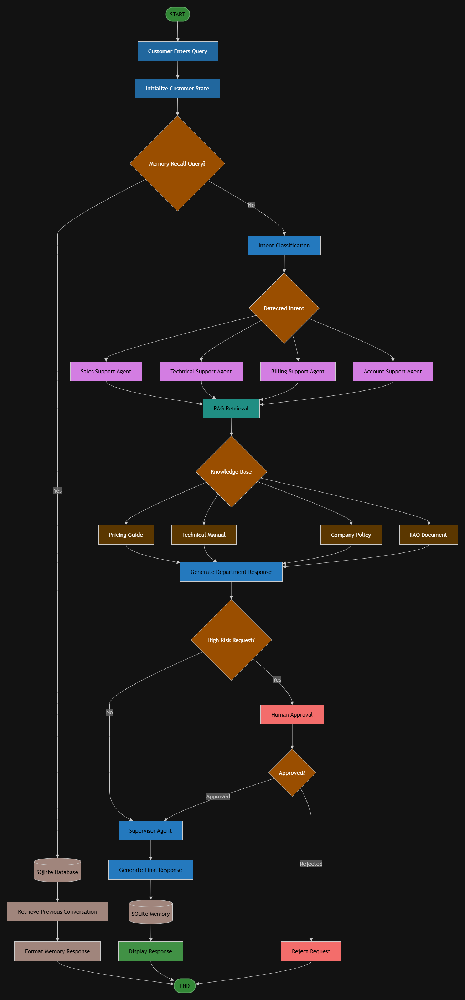

# AI-Powered Customer Support Automation System

## Overview

This project is an AI-powered Customer Support Automation System developed using **LangGraph**, **LangChain**, **Ollama**, **Retrieval-Augmented Generation (RAG)**, and **SQLite Memory**.

The system automatically classifies customer queries, routes them to the appropriate support department, retrieves relevant information from company documents, remembers previous customer interactions, requests human approval for high-risk operations, and generates a validated final response using a Supervisor Agent.

---

## Features

- Intent Classification
- Conditional Routing using LangGraph
- Specialized Support Agents
  - Sales Support
  - Technical Support
  - Billing Support
  - Account Support
- Retrieval-Augmented Generation (RAG)
- SQLite Conversation Memory
- Human-in-the-Loop Approval
- Supervisor Agent
- Final Response Generation

---

## Technology Stack

| Component | Technology |
|-----------|------------|
| Language | Python 3.11 |
| Framework | LangGraph |
| LLM Framework | LangChain |
| LLM | Ollama (Llama 3) |
| Vector Store | ChromaDB |
| Embeddings | HuggingFace / Ollama Embeddings |
| Database | SQLite |
| IDE | VS Code |

---

## Project Structure

```text
CustomerSupportAutomation/

├── agents/
├── graph/
├── rag/
├── memory/
├── database/
├── knowledge_base/
├── execution_screenshots/
├── diagrams/
│   └── workflowDiagram.png
├── app.py
├── README.md
├── requirements.txt
└── .gitignore
```

---

## Workflow Diagram



---

## Workflow

1. Customer enters a query.
2. LangGraph initializes the workflow state.
3. Memory queries are checked against SQLite.
4. Normal queries are classified into:
   - Sales
   - Technical
   - Billing
   - Account
5. The query is routed to the corresponding support agent.
6. RAG retrieves relevant information from the knowledge base.
7. A department response is generated.
8. High-risk requests trigger Human Approval.
9. The Supervisor Agent validates the response.
10. The conversation is stored in SQLite.
11. The final response is displayed to the customer.

---

## Knowledge Base

The system retrieves information from:

- Company Policy
- Pricing Guide
- Technical Manual
- FAQ Document

---

## Human-in-the-Loop

The following requests require manual approval:

- Refund Requests
- Subscription Cancellation
- Account Closure
- Compensation Requests
- Escalation to Management

---

## SQLite Memory

The system stores:

- Customer Query
- Detected Intent
- Department Response
- Final Response
- Timestamp

It can answer questions like:

> What was my previous support issue?

---

## Demonstration Queries

### Query 1

```
What are the pricing plans available for your software?
```

### Query 2

```
I forgot my account password.
```

### Query 3

```
My application crashes whenever I upload a file.
```

### Query 4

```
I need a refund for my annual subscription.
```

### Query 5

```
What was my previous support issue?
```

---

## Installation

Clone the repository:

```bash
git clone <your-github-repository-url>
```

Install dependencies:

```bash
pip install -r requirements.txt
```

Run the application:

```bash
python app.py
```

---

## Future Improvements

- Multi-user authentication
- Email and ticket integration
- Cloud deployment
- Voice-based customer support
- Sentiment analysis
- Admin dashboard

---

## Author

**Vansh Anand**

AI-Powered Customer Support Automation System

Built using LangGraph, LangChain, Ollama, RAG, SQLite, and Python.
